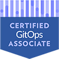

# Hi there, I'm Paris Nakita Kejser 👋

## Speaking Activities

### Upcoming

**None upcoming…**  
*Contact me if you need a speaker!* 🙂

### Past

**[Speaker: The Cloud Is Lying To You: What It Really Takes To Run On-Prem](https://sched.co/27FXa)** 
_KubeCon + CloudNativeCon North America 2025, Atlanta, Georgia_ 
Date: November 11, 2025 
[📺 Recording](https://www.youtube.com/watch?v=K5Wh7dfbr4s)

**[Speaker: From Chaos to Harmony, Transforming ML Engineering: A Kubernetes Adoption Journey](https://sched.co/1i7oM)** 
_CloudNativeCon+KubeCon, North America 2024, Salt Lake City, Utah_ 
Date: November 14, 2024 
[📺 Recording](https://www.youtube.com/watch?v=yqobcMJ_1as)

## Certification Activities

