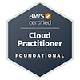
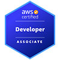

# Hi there, I'm Paris Nakita Kejser 👋

## Speaking Activities

### Upcoming

**[Speaker: From Chaos to Harmony, Transforming ML Engineering: A Kubernetes Adoption Journey](https://sched.co/1i7oM)** 
_CloudNativeCon+KubeCon, North America 2024, Salt Lake City_ 
Date: November 14, 2024

## Certification Activities

<!--
**parisnakitakejser/parisnakitakejser** is a ✨ _special_ ✨ repository because its `README.md` (this file) appears on your GitHub profile.

Here are some ideas to get you started:

- 🔭 I’m currently working on ...
- 🌱 I’m currently learning ...
- 👯 I’m looking to collaborate on ...
- 🤔 I’m looking for help with ...
- 💬 Ask me about ...
- 📫 How to reach me: ...
- 😄 Pronouns: ...
- ⚡ Fun fact: ...
-->
