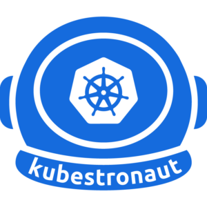

# Hi there, I'm Paris Nakita Kejser 👋

If you’re looking for a speaker or need real-world technical insights for your next article, feel free to reach out — I’m always up for sharing knowledge and making complex tech a bit more understandable (and maybe even fun).

## Speaking Activities

### Upcoming

[//]: <> (**None upcoming…**)

**[⚡Lightning Talk: Flux-Powered Bootstrapping a Kubernetes With GitOps and CaC](https://community.cncf.io/events/details/cncf-cloud-native-aalborg-presents-flux-powered-bootstrapping-amp-kubecon-takeaways/)** 
_Cloud Native Aalborg, Denmark_ 
Date: April 28, 2026

### Past

#### 2026

**[⚡Lightning Talk: Flux-Powered Bootstrapping a Kubernetes With GitOps and CaC](https://sched.co/2DY3s)** 
_KubeCon + CloudNativeCon Europe 2026, Amsterdam, The Netherlands_ 
_CNCF-hosted Co-located Events: FluxCon_ 
Date: Marts 23, 2026 
[📺 Recording](https://www.youtube.com/watch?v=Pcu7bWCqhe4&list=PLj6h78yzYM2MeuSNqpcDl-qdMeCe6vp6p&index=8)

#### 2025

**[Speaker: The Cloud Is Lying To You: What It Really Takes To Run On-Prem](https://community.cncf.io/events/details/cncf-cloud-native-aalborg-presents-talk-1-gitops-became-gitups-o0o-talk-2-the-cloud-is-lying-to-you-what-it-really-takes-to-run-on-prem/)** 
_Cloud Native Aalborg, Denmark_ 
Date: December 5, 2025 

**[Speaker: The Cloud Is Lying To You: What It Really Takes To Run On-Prem](https://sched.co/27FXa)** 
_KubeCon + CloudNativeCon North America 2025, Atlanta, Georgia_ 
Date: November 11, 2025 
[📺 Recording](https://www.youtube.com/watch?v=K5Wh7dfbr4s)

#### 2024

**[Speaker: From Chaos to Harmony, Transforming ML Engineering: A Kubernetes Adoption Journey](https://sched.co/1i7oM)** 
_CloudNativeCon+KubeCon, North America 2024, Salt Lake City, Utah_ 
Date: November 14, 2024 
[📺 Recording](https://www.youtube.com/watch?v=yqobcMJ_1as)

## Featured In

[A KubeCon Speaker's Guide to Building Resilient Stacks in the Age of AI-Driven Stack Bloat](https://www.aidatapress.com/news/paris-kejser-gitops-maturity-complexity-terma-group) 
Date: Marts, 2026 
Publisher: AI Data Press News

## Certification Activities

    

