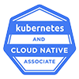

# Hi there, I'm Paris Nakita Kejser 👋

## Speaking Activities

### Upcoming

**None upcoming…**  
*Contact me if you need a speaker!* 🙂

### Past

#### 2025

**[Speaker: The Cloud Is Lying To You: What It Really Takes To Run On-Prem](https://community.cncf.io/events/details/cncf-cloud-native-aalborg-presents-talk-1-gitops-became-gitups-o0o-talk-2-the-cloud-is-lying-to-you-what-it-really-takes-to-run-on-prem/)** 
_Cloud Native Aalborg, Denmark_ 
Date: December 5, 2025 

**[Speaker: The Cloud Is Lying To You: What It Really Takes To Run On-Prem](https://sched.co/27FXa)** 
_KubeCon + CloudNativeCon North America 2025, Atlanta, Georgia_ 
Date: November 11, 2025 
[📺 Recording](https://www.youtube.com/watch?v=K5Wh7dfbr4s)

#### 2024

**[Speaker: From Chaos to Harmony, Transforming ML Engineering: A Kubernetes Adoption Journey](https://sched.co/1i7oM)** 
_CloudNativeCon+KubeCon, North America 2024, Salt Lake City, Utah_ 
Date: November 14, 2024 
[📺 Recording](https://www.youtube.com/watch?v=yqobcMJ_1as)

## Certification Activities

